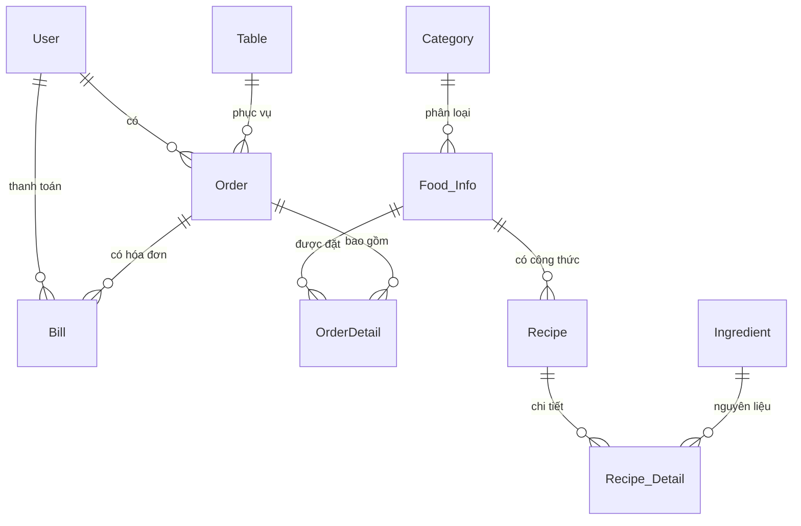
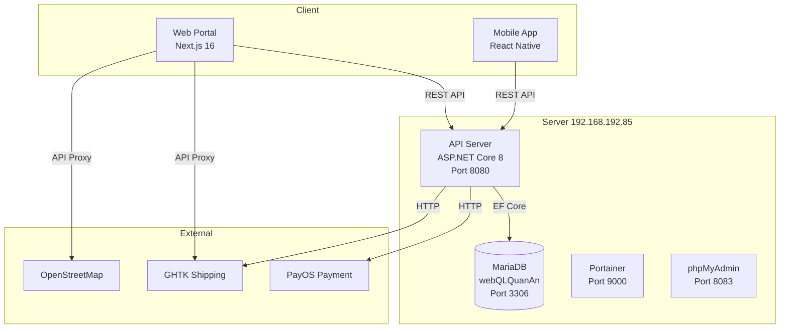

# 🍽️ RMS - Restaurant Management System

Hệ thống quản lý nhà hàng toàn diện — hỗ trợ đặt món online, quản lý bếp, thanh toán, giao hàng và quản trị nhà hàng.

---

## 📚 Tổng Quan Công Nghệ (Tech Stack)

| Layer | Công Nghệ | Mô Tả |
|-------|-----------|-------|
| **Frontend Web** | Next.js 16.2.9 + React 19.2.4 + Tailwind CSS 4 | Web portal đặt món & quản lý |
| **Backend API** | ASP.NET Core 8.0 + EF Core (Pomelo MySQL) | RESTful API server |
| **Database** | MariaDB trên Docker | Container `wordpress_lab-db-1` |
| **Mobile App** | React Native 0.72 (Expo ~49) | Ứng dụng di động |
| **Container** | Docker & Docker Compose | Triển khai API & DB |

---

## ✨ Tính Năng Chính

### 🧑‍🍳 Dành cho Khách hàng
- **Đặt món online** — Xem thực đơn, thêm vào giỏ hàng, thanh toán
- **Thanh toán linh hoạt** — Tiền mặt (COD) hoặc PayOS (QR Code)
- **Theo dõi đơn hàng** — real-time trên bản đồ Leaflet + GHTK
- **Đặt bàn trước** — Wizard 3 bước
- **Lịch sử đơn hàng** — Tra cứu, lọc theo trạng thái
- **Quản lý hồ sơ** — Cập nhật thông tin, đổi mật khẩu

### 👨‍🍳 Dành cho Bếp (Kitchen)
- **Xem đơn hàng real-time** — Món mới, đang nấu, hoàn tất
- **Đánh dấu hoàn thành** — Từng món hoặc toàn bộ đơn
- **Giao hàng GHTK** — Gửi đơn cho đơn vị vận chuyển

### 👑 Dành cho Admin
- **Quản lý thực đơn** — Thêm/sửa/xóa món ăn, danh mục
- **Quản lý bàn** — Sơ đồ bàn, trạng thái
- **Thống kê doanh thu** — Biểu đồ, báo cáo
- **Quản lý nguyên liệu** — Kho, công thức nấu
- **Quản lý người dùng** — Phân quyền, tài khoản
- **Quản lý hóa đơn** — Xem, đối soát

---

## 🗄️ Cấu Trúc Database (14 Tables)

### 📋 Danh sách bảng



| Bảng | Ý Nghĩa | Các Trường Chính |
|------|---------|-----------------|
| **User** | Người dùng | UserId, UserName, Password, Role, Right, FullName, Phone, Email, Address |
| **Food_Info** | Món ăn | FoodId, FoodName, FoodImage, UnitPrice, Description, CateId |
| **Category** | Danh mục món | CateId, CateName, Description |
| **Order** | Đơn hàng | OrderId, CreatedTime, **Status**, Total, Note, Discount, TableId, **PaymentStatus**, OrderType, DeliveryAddress, GhtkTrackingId |
| **OrderDetail** | Chi tiết đơn | FoodId + OrderId (composite PK), UnitPrice, **Status**, Quantity |
| **Bill** | Hóa đơn | BillId, Total, Discount, TotalFinal, Payment, CreatedTime, OrderId, UserId |
| **Bill_Detail** | Chi tiết hóa đơn | BillId + OrderId, Quantity, UnitPrice |
| **Table** | Bàn ăn | TableId, TableName, NumOfSeats, Status |
| **Ingredient** | Nguyên liệu | IngreId, IngreName, Stock, UnitMeasurement |
| **Recipe** | Công thức nấu | RecipeId, RecipeDescription, FoodId |
| **Recipe_Detail** | Chi tiết công thức | RecipeId + IngreId, UnitMeasurement, Quantity |
| **UserFavorites** | Món yêu thích | — |
| **OrderHistory** | Lịch sử đơn | — |
| **TableReservationHistory** | Lịch sử đặt bàn | — |

> ⚠️ **Lưu ý:** Database không có ràng buộc khóa ngoại (Foreign Key) vật lý — tất cả quan hệ được quản lý qua EF Core trong code.

---

## 🌐 API Backend (ASP.NET Core 8.0)

### Cấu trúc Project
```
RMS-APIServer/
└── Restaurant-Manangment-System-RMS-APIServer/
    └── RMS-APIServer/
        ├── Controllers/       # 14 controllers
        ├── Models/            # 14 models + DTOs + 2 DbContexts
        ├── Services/          # PayOSService.cs
        ├── Middleware/        # CorsMiddleware.cs
        ├── Program.cs         # Entry point
        ├── appsettings.json   # Config (DB, JWT, PayOS)
        └── Dockerfile         # Multi-stage build
```

### API Endpoints

#### 📦 CRUD Cơ bản
| Method | Endpoint | Mô tả |
|--------|----------|-------|
| GET | `/api/{entity}` | Lấy danh sách |
| GET | `/api/{entity}/{id}` | Lấy chi tiết |
| POST | `/api/{entity}` | Tạo mới |
| PUT | `/api/{entity}/{id}` | Cập nhật (⚠️ partial update cho Order & OrderDetail) |
| DELETE | `/api/{entity}/{id}` | Xóa |

#### 🔐 Auth
| Method | Endpoint | Mô tả |
|--------|----------|-------|
| POST | `/api/User/login` | Đăng nhập (userName + password) |
| POST | `/api/User` | Đăng ký |
| PUT | `/api/User/{id}` | Cập nhật thông tin |

#### 🛒 Order
| Method | Endpoint | Mô tả |
|--------|----------|-------|
| GET | `/api/Order/table/{tableId}` | Đơn theo bàn |
| GET | `/api/Order/user/{userId}` | Đơn theo người dùng |
| GET | `/api/Order/status/{status}` | Đơn theo trạng thái |

#### 💳 PayOS
| Method | Endpoint | Mô tả |
|--------|----------|-------|
| POST | `/api/PayOS/create-payment` | Tạo link thanh toán |
| GET | `/api/PayOS/status/{orderCode}` | Kiểm tra trạng thái |
| POST | `/api/PayOS/confirm/{orderCode}` | Xác nhận thanh toán |
| POST | `/api/PayOS/webhook` | Webhook callback |

#### 📦 GHTK (Shipping) — Next.js API Proxy
| Method | Endpoint | Mô tả |
|--------|----------|-------|
| GET | `/api/ghtk/fee` | Tính phí vận chuyển |
| POST | `/api/ghtk/order` | Tạo đơn giao hàng |
| GET | `/api/ghtk/track/{id}` | Tra cứu vận đơn |

---

## 🖥️ Frontend Web (Next.js 16 + React 19 + Tailwind CSS 4)

### Cấu trúc Project
```
web-portal/
├── src/
│   ├── app/               # Pages (App Router)
│   │   ├── page.tsx       # Homepage
│   │   ├── layout.tsx     # Root layout (providers)
│   │   ├── account/       # Dashboard
│   │   ├── admin/         # {menu, revenue, tables}
│   │   ├── checkout/      # Thanh toán multi-step
│   │   ├── kitchen/       # Quản lý bếp
│   │   ├── menu/          # Thực đơn
│   │   ├── orders/        # Lịch sử đơn hàng
│   │   ├── profile/       # Hồ sơ
│   │   ├── reservations/  # Đặt bàn
│   │   ├── table/         # Sơ đồ bàn
│   │   └── tracking/      # Theo dõi giao hàng
│   ├── components/ui/     # UI components
│   ├── contexts/          # React contexts
│   └── lib/utils.ts       # Utilities
├── .env.local             # Biến môi trường
├── next.config.ts         # Next.js config
├── tailwind.config.ts     # Tailwind config
└── package.json           # Dependencies
```

### Packages chính
```json
{
  "next": "16.2.9", "react": "19.2.4",
  "tailwindcss": "^4", "framer-motion": "^12.40.0",
  "leaflet": "^1.9.4", "lucide-react": "^1.17.0",
  "shadcn": "^4.11.0", "class-variance-authority": "^0.7.1"
}
```

### Danh sách trang

| Route | Trang | Yêu cầu Auth | Vai trò |
|-------|-------|:---:|:-------:|
| `/` | Trang chủ — hero, danh mục, lưới món ăn, tìm kiếm | ❌ | Tất cả |
| `/menu` | Thực đơn đầy đủ + bộ lọc | ❌ | Tất cả |
| `/account` | Dashboard với điều hướng theo vai trò | ✅ | Tất cả |
| `/profile` | Chỉnh sửa thông tin + đổi mật khẩu | ✅ | Tất cả |
| `/orders` | Lịch sử đơn hàng (tabs, tìm kiếm, sắp xếp) | ✅ | Tất cả |
| `/checkout` | Thanh toán multi-step (map, delivery, PayOS) | ✅ | Customer |
| `/kitchen` | Quản lý bếp (real-time orders, mark complete, ship GHTK) | ✅ | Admin/Bep |
| `/table` | Sơ đồ bàn ăn (grid, trạng thái) | ✅ | Admin/NV |
| `/reservations` | Đặt bàn (wizard 3 bước) | ❌ | Tất cả |
| `/tracking/[orderId]` | Theo dõi giao hàng (Leaflet map + GHTK) | ✅ | Tất cả |
| `/admin/tables` | CRUD bàn ăn | Admin | Admin |
| `/admin/menu` | CRUD món ăn | Admin | Admin |
| `/admin/revenue` | Thống kê doanh thu (biểu đồ) | Admin | Admin |

### React Contexts
| Context | Chức năng |
|---------|-----------|
| **AuthContext** | Đăng nhập, đăng ký, đăng xuất — lưu UserInfo vào localStorage |
| **CartContext** | Giỏ hàng — addItem, removeItem, updateQuantity, clearCart, totalItems, totalPrice |
| **ToastContext** | Thông báo toast (tự động ẩn sau 3s) |

---

## 📱 Mobile App (React Native / Expo)

### Cấu trúc
```
RMSMobile/Restaurant-Manangment-System-RMSMobile-Testing/
├── screens/          # 18 màn hình
├── components/       # RefreshButton, ScreenHeader, ToastNotification
├── services/         # apiService.js (axios)
├── context/          # AuthContext.js, ToastContext.js
└── App.js            # Root (NavigationContainer + Stack Navigator)
```

### 18 màn hình
| Màn hình | Chức năng |
|----------|-----------|
| HomeScreen | Trang chủ |
| MenuScreen | Thực đơn |
| OrdersScreen | Đơn hàng của tôi |
| ProfileScreen | Hồ sơ |
| LoginScreen | Đăng nhập |
| RegisterScreen | Đăng ký |
| ChangePasswordScreen | Đổi mật khẩu |
| UpdateInformationScreen | Cập nhật thông tin |
| TableScreen | Sơ đồ bàn |
| BillScreen | Hóa đơn |
| BillManagerScreen | Quản lý hóa đơn |
| ReportScreen | Báo cáo thống kê |
| MenuManagerScreen | Quản lý thực đơn |
| OrderDetailManagerScreen | Quản lý chi tiết đơn |
| IngredientManagerScreen | Quản lý nguyên liệu |
| UserManagementScreen | Quản lý người dùng |
| AdminScreen | Trang Admin |

---

## 🚀 Hướng Dẫn Chạy

### Yêu cầu
- **Node.js** ≥ 18
- **.NET SDK** 8.0
- **Docker** (cho database & API server)
- **Expo CLI** (cho mobile app)

### 1. Chạy Web Portal (Local)
```bash
cd web-portal
npm install
npm run dev
# → http://localhost:3000
```

### 2. Chạy API Server (Docker)
```bash
cd RMS-APIServer/Restaurant-Manangment-System-RMS-APIServer/RMS-APIServer

# Build & publish
dotnet publish -c Release -o ./publish

# Build Docker image
docker build -t bao2211/rms-apiserver:mysql .

# Run container
docker run -d --name rms-api-server --network root_rms-network -p 8080:8080 \
  -e DB__HOST=wordpress_lab-db-1 \
  -e DB__DATABASE=webQLQuanAn \
  -e DB__USER=root \
  -e DB__PASSWORD=CaoBao2211 \
  bao2211/rms-apiserver:mysql
```

### 3. Chạy Mobile App
```bash
cd RMSMobile/Restaurant-Manangment-System-RMSMobile-Testing
npm install
npx expo start
```

### 4. Biến môi trường (`.env.local`)
```env
NEXT_PUBLIC_API_BASE_URL=http://192.168.192.85:8080
GHTK_TOKEN=your_ghtk_token
```

---

## 🔑 Tài Khoản Mẫu

| Tên đăng nhập | Mật khẩu | Vai trò | Quyền truy cập |
|:---:|:---:|:---:|:---|
| `VAnh` | `VAnh123` | **Admin** | Toàn bộ hệ thống |
| `khang` | `khang123` | **Bếp (Kitchen)** | Trang bếp, tài khoản |
| `bao` | `bao2211` | **Thu ngân (Cashier)** | Hóa đơn, báo cáo |
| `ngoc` | `Ngoc123` | **Khách hàng** | Đặt món, theo dõi |
| `abc` | `abc1234` | **Nhân viên** | Bàn, đơn hàng |

---

## 🌐 Thông Tin Server

| Tài nguyên | Địa chỉ |
|-----------|---------|
| **Server IP** | `192.168.192.85` |
| **API Server** | `http://192.168.192.85:8080` |
| **Portainer** | `http://192.168.192.85:9000` |
| **phpMyAdmin** | `http://192.168.192.85:8083` |
| **MariaDB** | `192.168.192.85:3306` (container: `wordpress_lab-db-1`) |

---

## 🧩 Kiến Trúc Hệ Thống


